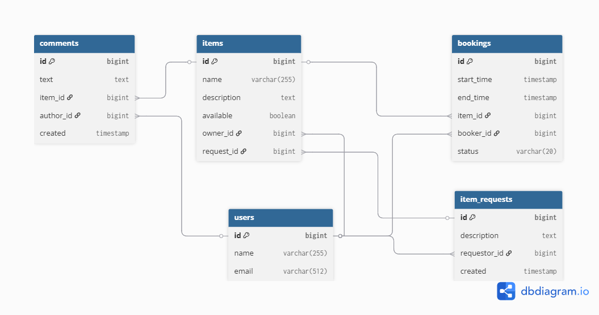

# ShareIt

Сервис аренды вещей между пользователями. Проект разделён на два модуля:  
- **gateway** — валидация входящих запросов, работа с DTO и делегирование в сервер.  
- **server** — бизнес-логика, работа с БД, обработка исключений.

📌 Учебный проект Яндекс Практикума (Java-разработчик, 2025).

---

## 🚀 Функционал
- Регистрация и управление пользователями.  
- Добавление и редактирование вещей владельцем.  
- Поиск вещей по названию и описанию (с фильтрацией).  
- Создание бронирований, подтверждение/отклонение владельцем.  
- Просмотр истории бронирований (по статусу и роли).  
- Добавление комментариев к вещам после завершённого бронирования.  

---

## 🛠️ Стек технологий
- Java 17  
- Spring Boot 3 (Web, Validation, Data JPA, Lombok)  
- PostgreSQL  
- H2 (для тестов)  
- Flyway (миграции БД)  
- Maven  
- RestTemplate (во gateway)  
- JUnit 5, Mockito  
- Docker & Docker Compose  

---

## ⚙️ Архитектура
- **Gateway** принимает запросы от клиентов, валидирует данные (аннотации, группы валидации) и отправляет их на **Server** через RestTemplate.  
- **Server** обрабатывает бизнес-логику, взаимодействует с базой данных, хранит пользователей, вещи, бронирования и комментарии.  
- Общение между модулями через HTTP.  
- Используется глобальный `ExceptionHandler` для ошибок.  

---

## ▶️ Запуск проекта

### Вариант 1. Docker Compose
```bash
docker compose up --build
```
После запуска:

Gateway доступен на http://localhost:8080

Server доступен на http://localhost:9090

### Вариант 2. Локально

Запусти PostgreSQL (параметры указаны в application.properties).

В корне проекта выполни:
```bash
mvn clean install
mvn -pl server spring-boot:run
```

---

## 🧪 Тестирование
```bash
mvn test
```
Используются JUnit 5, Mockito, H2.

Покрыты сервисные, интеграционные и JSON-тесты.

---

## 📚 Основные эндпоинты
### Users

POST /users — создать пользователя

GET /users/{id} — получить пользователя

PATCH /users/{id} — обновить данные

DELETE /users/{id} — удалить

### Items

POST /items — добавить вещь

PATCH /items/{itemId} — обновить вещь

GET /items/{itemId} — получить вещь

GET /items?search=text — поиск вещей

POST /items/{itemId}/comment — добавить комментарий

### Bookings

POST /bookings — создать бронирование

PATCH /bookings/{bookingId}?approved={true|false} — подтверждение/отклонение

GET /bookings/{bookingId} — просмотр бронирования

GET /bookings?state=ALL — список бронирований пользователя

GET /bookings/owner?state=ALL — список бронирований владельца

---

## 📈 ER-диаграмма


